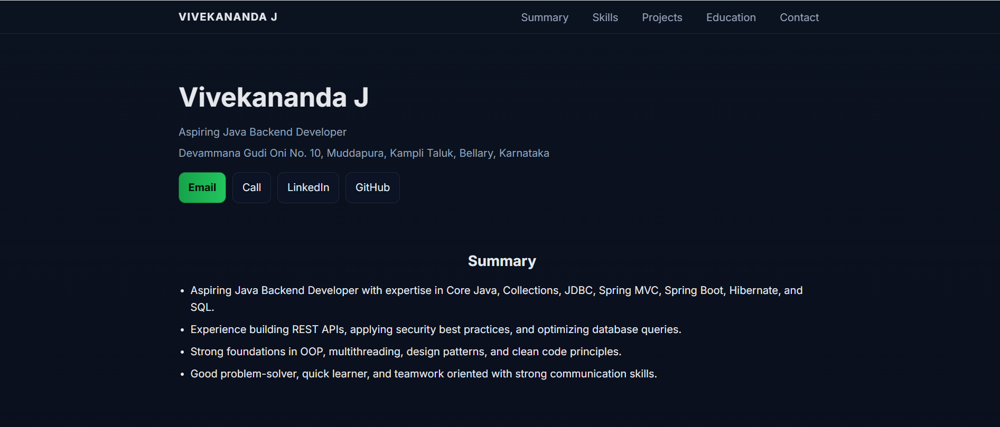

# 🌐 Portfolio Website

This is my **personal portfolio website** built to showcase my skills, projects, and experiences.  
The site highlights my journey as a developer and serves as a central place to explore my work.  

---

## 🚀 Features
- Responsive design (works on mobile, tablet, and desktop)
- About Me section
- Projects showcase with descriptions
- Skills and technologies
- Contact information

---

## 🛠️ Tech Stack
- **Web Tech**: HTML, CSS, JavaScript
- **Frameworks**: Spring, Spring MVC, Spring Boot, Hibernate
- **Programming**: Core Java, Collections, OOP, Multithreading
- **Database**: JDBC, SQL (Joins, Views, Stored Procedures, Triggers, Query Optimization), Mongo DB, PostgreSQL
- **Web/API**: REST APIs, JSON, HTTP, Authentication, Validation, Postman
- **Tools & DevOps**: Git, Photoshop, IDEs, Build & Deployment 

---

## 📂 Project Structure
Portfolio/
│── index.html # Main HTML file
│── style.css # Stylesheet
│── assets/ # Images, icons, etc.

---

## 🌐 Live Demo
🔗 [View Portfolio](https://vivekanandj.github.io/Portfolio/)

---

## 📸 Screenshots
_Add a screenshot or preview of your site here (optional)_  

Example:  

.png)
.png)
.png)
.png)

---

## 📑 Projects

Here are some of the projects featured in my portfolio:

1. **Budget Tracking App**  
   A mobile app for managing daily expenses, with role-based dashboards for users and admins.  
   - Tech: Flutter, SQLite  
   - Features: Add expenses, admin approval, CSV export  

2. **Book Finder App**  
   A React-based application to search, filter, and favorite books with local storage.  
   - Tech: React.js  
   - Features: Category filter, search, pagination, modal for details  

3. **Employee Management System**  
   A MERN project to manage employee details with image upload, validation, and search functionality.  
   - Tech: MongoDB, Express.js, React.js, Node.js
     
4. **Event Management System**  
   A web application for managing events, including creation, registration, and attendance tracking.  
   - Tech: Spring Boot, PostgreSQL, Postman (for API testing)  
   - Features: Create and manage events, REST APIs for CRUD operations, user registration, validation, and authentication  

---

## 📬 Contact
If you'd like to connect, feel free to reach out:  

- **Email**: vivekanandaj867@example.com  
- **LinkedIn**: https://www.linkedin.com/in/vivekananda-j-791415192/ 
- **GitHub**: [Vivekanandj](https://github.com/Vivekanandj)  

---

⭐ Don’t forget to give this repo a star if you like it!
